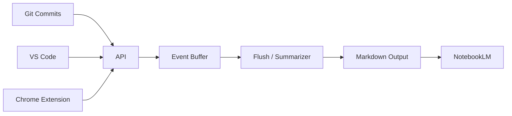

# 🧠 notebooklm-sync

> **Turn your ongoing project activity into a living memory stream for NotebookLM.**

---

### 🚀 The Concept

**notebooklm-sync** is an **incremental, append-only memory compiler**. It sits alongside your work, observing events (commits, research, decisions), and compiles them into structured Markdown documents.

 NotebookLM ingest these documents to maintain a **living model of your project**, allowing it to answer questions like:
- *"Why did we change the API last week?"*
- *"Summarize the research behind this decision."*
- *"What is the current state of the architecture?"*

---

### ✨ Features

| Feature | Description | Status |
| :--- | :--- | :--- |
| **🔗 Git Integration** | Automatically capture every commit message and branch context. | ✅ Ready |
| **💡 IDE Integration** | Send code snippets directly from VS Code with a simple command. | ✅ Ready |
| **🌐 Browser Integration** | Clip research, articles, and documentation from Chrome. | ✅ Ready |
| **🛡️ Watermarking** | Ensures no data is duplicated, even across restarts. | ✅ Ready |
| **🐳 Docker Ready** | Fully containerized for easy deployment anywhere. | ✅ Ready |

---

### 🛠️ Architecture



---

### 📦 Installation & Usage

#### 1. Start the Server
Run the API locally or via Docker.

**Local:**
```bash
npm run dev
# Server running on http://localhost:8787
```

**Docker:**
```bash
docker build -t notebooklm-sync .
docker run -p 8787:8787 notebooklm-sync
```

#### 2. Connect Your Tools

**🖥️ Git Hook**
```bash
# Copy the hook to your repo
cp connectors/git/hooks/post-commit .git/hooks/
chmod +x .git/hooks/post-commit
```

**💻 CLI Tool (`nls`)**
```bash
# Install locally
cd apps/cli && npm link

# Usage
echo "data" | nls capture
nls note "Refactoring auth..."
nls flush
```

**📊 Dashboard**
Access the local dashboard at **http://localhost:8787** to view status and flush events manually.

**🔌 Webhooks (Linear)**
Configure your Linear webhook to point to your server (e.g. via ngrok or localhost):
`POST /v1/webhooks/linear`
*Captures Issue Created and Updated events.*

**📝 VS Code Extension**
1. Navigate to `apps/vscode-extension`.
2. Run `npm install` and press `F5` to debug (or package it).
3. Select code > `Cmd+Shift+P` > `NotebookLM: Save Selection`.

**🌐 Chrome Extension**
1. Navigate to `chrome://extensions`.
2. Enable "Developer Mode".
3. "Load Unpacked" > Select `apps/browser-extension`.
4. Right-click text > `Save to NotebookLM`.

#### 3. Flush to Markdown
When you are ready to update NotebookLM, trigger a flush:
```bash
curl -X POST http://localhost:8787/v1/flush
```
This creates a new file in `notebooklm_output/<project-id>/YYYY-MM-DD.md`.

---

### 🧪 Verifying the System
Run the comprehensive integration test suite to ensure all connectors are communicating with the API correctly.

```bash
npm test
```
*Tests verify Git, IDE, and Browser event flows.*

---

### 📚 Philosophy

**Incremental by Design**
- Past output is **never rewritten**.
- New information is **always appended**.
- NotebookLM sees: *"Here is what happened since last time."*

**What counts as a "Change"?**
- A code commit.
- A design decision snippet.
- A useful URL.
- A manual note.

---

**notebooklm-sync** — *Never forget what happened.*
